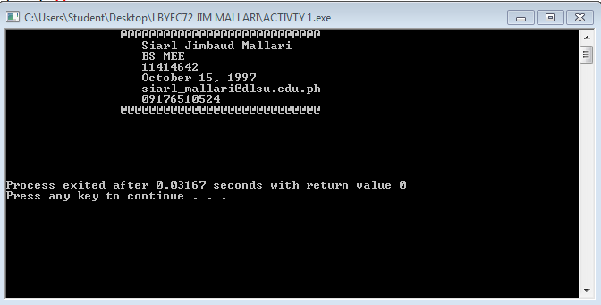
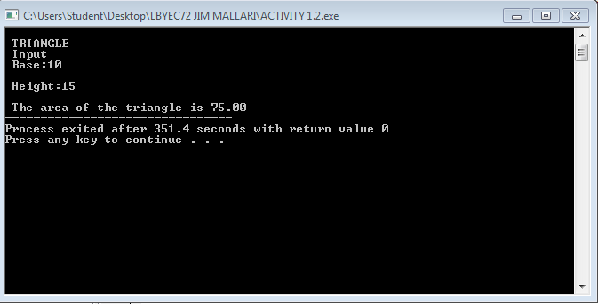
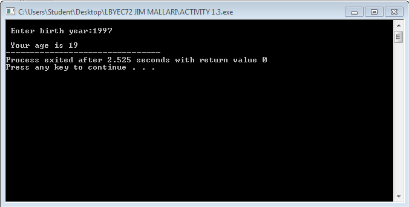
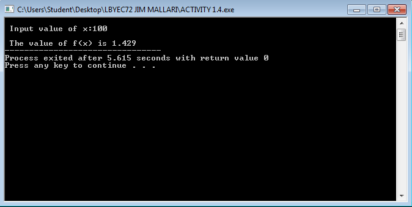

# Activity1-MallariS


```
#include <stdio.h>
#include <stdlib.h>
#define p printf
#define s scanf

int main()
{
	p("\t\t@@@@@@@@@@@@@@@@@@@@@@@@@@@@ \n");
	p("\t \t   Siarl Jimbaud Mallari \n");
	p("\t \t   BS MEE \n");
	p("\t \t   11414642 \n");
	p("\t \t   October 15, 1997 \n");
	p("\t \t   siarl_mallari@dlsu.edu.ph \n");
	p("\t \t   09176510524 \n");
	p("\t\t@@@@@@@@@@@@@@@@@@@@@@@@@@@@ \n\n\n\n\n");
	
	
	return 0;
	
	
}
```



```
#include <stdio.h>
#include <stdlib.h>
#define p printf
#define s scanf
 
int main()
{

	float base, height, area;
	p("\n TRIANGLE");
	p("\n Input");
	p("\n Base:");
	s("%f", &base);
	p("\n Height:");
	s("%f", &height);
	area=(base*height)/2;
	p("\n The area of the triangle is %.2f", area);
	
	
	
	return 0;
	
	
}

```


```
#include <stdio.h>
#include <stdlib.h>
#define p printf
#define s scanf

int main()
{
	int birth, age;
	p("\n Enter birth year:");
	s("%d", &birth);
	age=2016-birth;
	p("\n Your age is %d", age);
	
	return 0;	
	
	
}
```


```
#include <stdio.h>
#include <stdlib.h>
#define p printf
#define s scanf

int main()
{
	
	float x, fx;
	p("\n Input value of x:");
	s("%f", &x);
	fx=x/70;
	p("\n The value of f(x) is %.3f", fx);
	
	return 0;	
	
	
}

```


